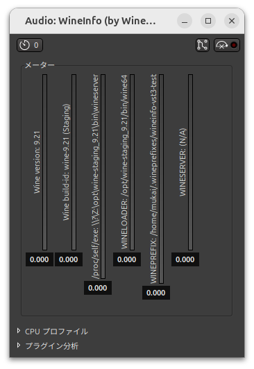

# WineInfo VST3

A diagnostic VST3 plugin that displays Wine environment information.



## Building

### Prerequisites

This project uses Dev Container for building.

- [Dev Container CLI](https://github.com/devcontainers/cli)
- Docker or a compatible container runtime

### Build Steps

1. Build the dev container:

```bash
devcontainer build --workspace-folder .
```

2. Start the dev container:

```bash
devcontainer up --workspace-folder .
```

3. Configure the project:

```bash
devcontainer exec --workspace-folder . cmake --preset mingw-w64-x86_64
```

4. Build the plugin:

```bash
devcontainer exec --workspace-folder . cmake --build build --target wineinfo
```

The built plugin will be located at `build/VST3/Release/wineinfo.vst3/`. Copy the `wineinfo.vst3` folder to the VST3 plugin directory: `${WINEPREFIX}/drive_c/Program Files/Common Files/VST3/`
